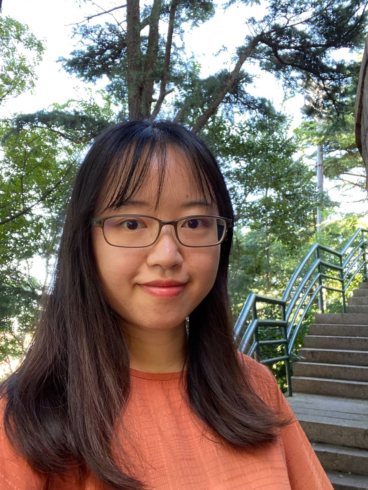
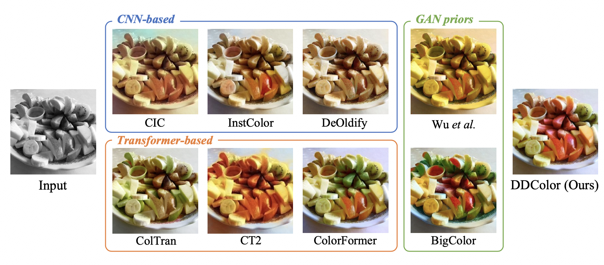
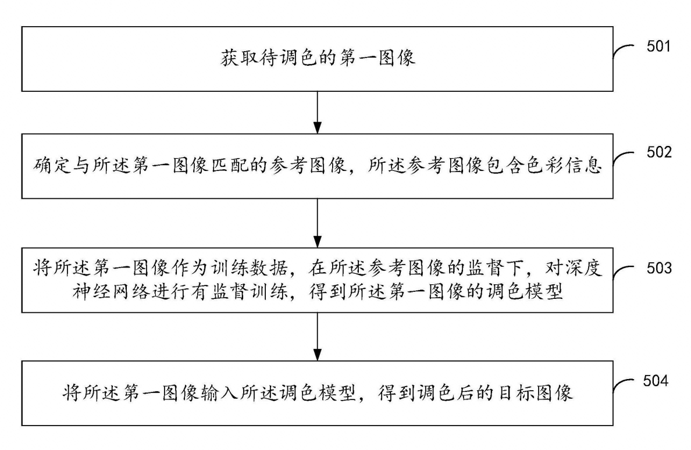
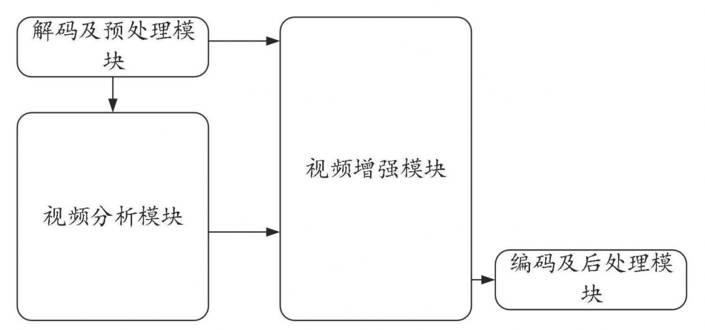
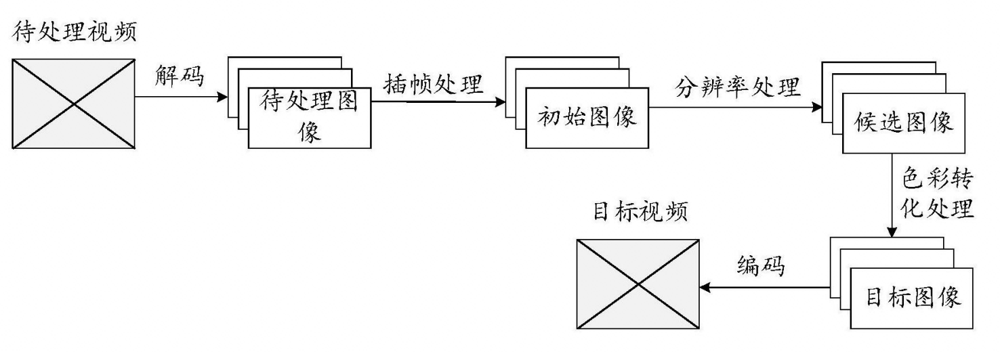
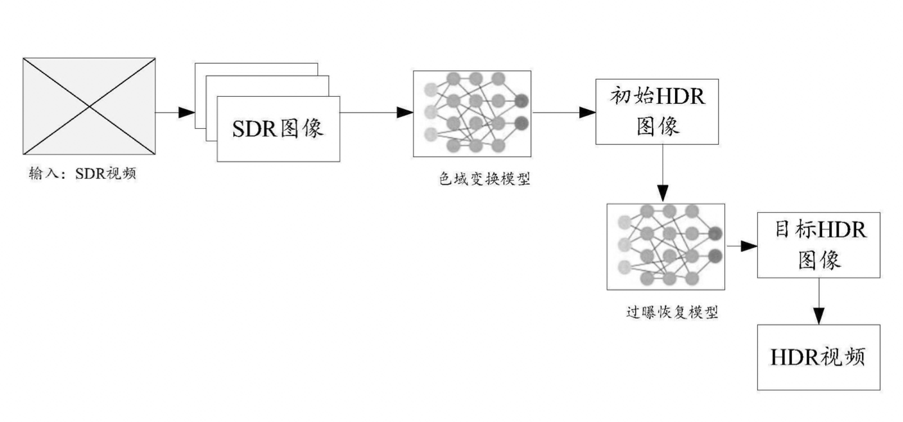
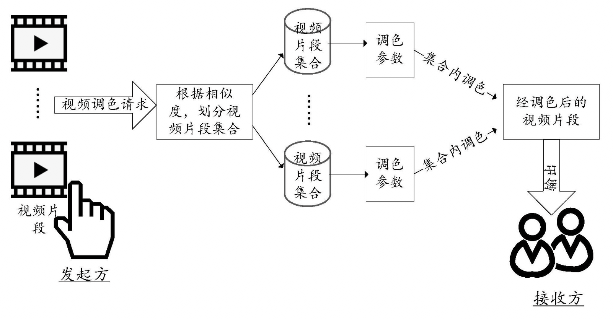

**Email:** vinkeyoy[at]gmail.com

**Links:** [[Google Scholar](https://scholar.google.com/citations?user=pYeM5JUAAAAJ&hl=zh-CN)] [[GitHub](https://github.com/Vicky0522)]

**Curriculum Vitae:** [updating] .

## About me
I am Wenqi Ouyang, a senior research engineer at Damo Research, Alibaba Group.

Prior to joining Alibaba, I received a M.Sc. degree in the department of computer science and technology from Tsinghua University, at where I was advised by [Kun Xu](https://cg.cs.tsinghua.edu.cn/people/~kun/). I received my B.Sc. from the department of fundamental physics and mathematics in Tsinghua University.

My research projects mainly focus on computer vision, machine learning, video enhancement and image editing.

   
   
   

## Education
* B. Sc. in Fundamental Physics and Mathematics, Tsinghua University, Beijing. September 2012 ~ July 2016.
* M. Sc. in Computer Science and Technology, Tsinghua University, Beijing. September 2016 ~ July 2019.

## Working Experience
* Research Intern in ByteDance AI Lab, Beijing. July 2017 ~ Septempber 2017.
* Research Engineer in Damo Research, Alibaba Group, Beijing. July 2019 ~ Present.

## Papers
<table>
  <tr>
    <td></td>
    <td>
      
<b>DDColor: Towards Photo-Realistic and Semantic-Aware Image Colorization via Dual Decoders</b>

      
Xiaoyang Kang, Tao Yang, <b>Wenqi Ouyang</b>, Peiran Ren, Lingzhi Li, Xuansong Xie.

      
Submitted, 2022.

      
<a href="https://arxiv.org/abs/2212.11613" target="_blank" rel="noopener">
				 <i class="fa fa-file" aria-hidden="true"></i> arXiv </a> 
      

    </td>
  </tr>
</table>

## Patents
<table>
  <tr>
    <td></td>
    <td>
      
<b>图像、视频的调色方法、系统、设备及存储介质</b>

      
<b>欧阳雯琪</b>, 杨涛

      
CN Patent 114,549,674 A, 2022.

    </td>
  </tr>
  <tr>
    <td></td>
    <td>
      
<b>视频处理方法及装置</b>

      
林宪晖、<b>欧阳雯琪</b>、高占宁、任沛然

      
CN Patent 114,302,175 A, 2022.

    </td>
  </tr>
  <tr>
    <td></td>
    <td>
      
<b>视频处理方法及装置</b>

      
林宪辉、高占宁、<b>欧阳雯琪</b>、杨涛、任沛然、马菲莹、谢宣松、張磊

      
CN Patent 114,286,126 A, 2022.

    </td>
  </tr>
  <tr>
    <td></td>
    <td>
      
<b>图像处理模型训练方法及装置</b>

      
郑全龙、曾辉、<b>欧阳雯琪</b>

      
CN Patent 114,092,756 A, 2022.

    </td>
  </tr>
  <tr>
    <td></td>
    <td>
      
<b>一种视频调色方法、媒体数据处理方法、设备及存储介质</b>

      
<b>欧阳雯琪</b>

      
CN Patent 113,497,954 A, 2022.

    </td>
  </tr>
</table>

