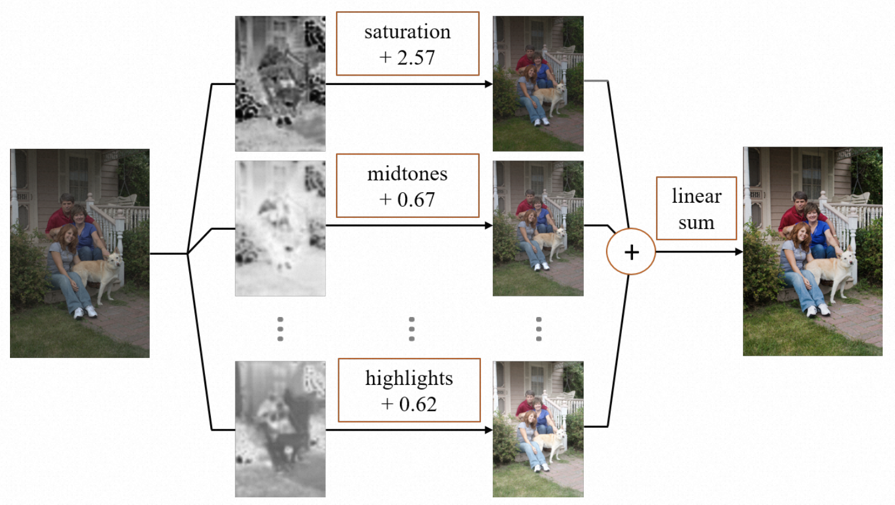

**Email:** vinkeyoy@gmail.com

**Links:** [[Google Scholar](https://scholar.google.com/citations?user=pYeM5JUAAAAJ&hl=zh-CN)] [[GitHub](https://github.com/Vicky0522)]

## About me
I am currently a research associate at [MMLab@NTU](https://www.mmlab-ntu.com/index.html), advised by Prof. [Xingang Pan](https://xingangpan.github.io/). I previously served as a senior research engineer at Damo Academy, Alibaba Group, where I focus on researching video enhancement and editing, working with [Peiran Ren](https://scholar.google.com/citations?user=x5dEuxsAAAAJ&hl=en), [Xuansong Xie](https://scholar.google.com/citations?user=M0Ei1zkAAAAJ&hl=en) and [Lei Zhang](https://www4.comp.polyu.edu.hk/~cslzhang/). Prior to joining Alibaba, I earned my M.Sc. degree in computer science and technology from Tsinghua University. I also hold a B.Sc. in fundamental physics and mathematics from Tsinghua University.

My research interests span several areas, including deep learning, computer vision, and image and video generation and editing. I am also interested in exploring the applications of natural language processing in multimedia analysis.

 

## Education
* B. Sc. in Fundamental Physics and Mathematics, Tsinghua University, Beijing. September 2012 ~ July 2016.
* B. BM. (dual-degree) in Business Administration in Economics and Management. September 2013 ~ July 2016.
* M. Sc. in Computer Science and Technology, Tsinghua University, Beijing. September 2016 ~ July 2019.

## Working Experience
* Research Intern in ByteDance AI Lab, Beijing. July 2017 ~ Septempber 2017.
* Research Engineer in Damo Academy, Alibaba Group, Beijing. July 2019 ~ Present.

## Publications
<ul class="publication-list">
  <li>
    

      
    

    

      <b>RSFNet: A White-Box Image Retouching Approach using Region-Specific Color Filters</b> 
      <b>Wenqi Ouyang</b>, Yi Dong, <a href="https://piddnad.github.io/xiaoyangkang"> Xiaoyang Kang </a>, <a href="https://scholar.google.com/citations?user=x5dEuxsAAAAJ&hl=en"> Peiran Ren </a>, Xin Xu, <a href="https://scholar.google.com/citations?user=M0Ei1zkAAAAJ&hl=en"> Xuansong Xie </a>.  
      <b><em>International Conference on Computer Vision (ICCV, 2023)</em></b> 
      <a href="https://arxiv.org/abs/2303.08682" target="_blank" rel="noopener">
				 <i class="fa fa-file" aria-hidden="true"></i> arXiv </a> 
      <a href="https://github.com/Vicky0522/RSFNet" target="_blank" rel="noopener">
				 <i class="fa fa-file" aria-hidden="true"></i>  Code </a> 
    

  </li>
  <li>
    

      
    

    

      <b>DDColor: Towards Photo-Realistic and Semantic-Aware Image Colorization via Dual Decoders</b> 
      <a href="https://piddnad.github.io/xiaoyangkang"> Xiaoyang Kang </a>, <a href="https://cg.cs.tsinghua.edu.cn/people/~tyang/"> Tao Yang </a>, <b>Wenqi Ouyang</b>, <a href="https://scholar.google.com/citations?user=x5dEuxsAAAAJ&hl=en"> Peiran Ren </a>, <a href="https://lingzhili.com/"> Lingzhi Li </a>, <a href="https://scholar.google.com/citations?user=M0Ei1zkAAAAJ&hl=en"> Xuansong Xie </a>.  
      <b><em>International Conference on Computer Vision (ICCV, 2023)</em></b> 
      <a href="https://arxiv.org/abs/2212.11613" target="_blank" rel="noopener">
				 <i class="fa fa-file" aria-hidden="true"></i> arXiv </a> 
      <a href="https://github.com/piddnad/DDColor" target="_blank" rel="noopener">
				 <i class="fa fa-file" aria-hidden="true"></i>  Code </a> 
    

  </li>
</ul>

## Patents
<ul class="publication-list">
  <li>
    

      <b>Methods, systems, devices, and storage media for color grading of images and videos</b> 
      <b>Wenqi Ouyang</b>, <a href="https://cg.cs.tsinghua.edu.cn/people/~tyang/"> Tao Yang </a>.  
      CN Patent 114,549,674 A, 2022.  
    

  </li>
  <li>
    

      <b>Methods and apparatus for video processing</b> 
      <a href="https://scholar.google.com/citations?user=wLTXeNwAAAAJ&hl=fr"> Xianhui Lin </a>, <a href="https://scholar.google.com/citations?user=CF2CM2UAAAAJ&hl=zh-CN"> Zhanning Gao </a>, <b>Wenqi Ouyang</b>, <a href="https://scholar.google.com/citations?user=x5dEuxsAAAAJ&hl=en"> Peiran Ren </a>.  
      CN Patent 114,302,175 A, 2022.  
    

  </li>
  <li>
    

      <b>Methods and apparatus for video processing</b> 
      <a href="https://scholar.google.com/citations?user=wLTXeNwAAAAJ&hl=fr"> Xianhui Lin </a>, <a href="https://scholar.google.com/citations?user=CF2CM2UAAAAJ&hl=zh-CN"> Zhanning Gao </a>, <b>Wenqi Ouyang</b>, <a href="https://cg.cs.tsinghua.edu.cn/people/~tyang/"> Tao Yang </a>, <a href="https://scholar.google.com/citations?user=x5dEuxsAAAAJ&hl=en"> Peiran Ren </a>, Feiying Ma, <a href="https://scholar.google.com/citations?user=M0Ei1zkAAAAJ&hl=en"> Xuansong Xie </a>, <a href="https://www4.comp.polyu.edu.hk/~cslzhang/"> Lei Zhang </a>.  
      CN Patent 114,286,126 A, 2022.  
    

  </li>
  <li>
    

      <b>Methods and apparatus for training image processing model</b> 
      <a href="https://quanlzheng.github.io/"> Quanlong Zheng </a>, <a href="https://huizeng.github.io/"> Hui Zeng </a>, <b>Wenqi Ouyang</b>.  
      CN Patent 114,092,756 A, 2022.   
    

  </li>
  <li>
    

      <b>A method for video color grading, media data processing, device, and storage medium</b> 
      <b>Wenqi Ouyang</b>.  
      CN Patent 113,497,954 A, 2021.  
    

  </li>
</ul>
